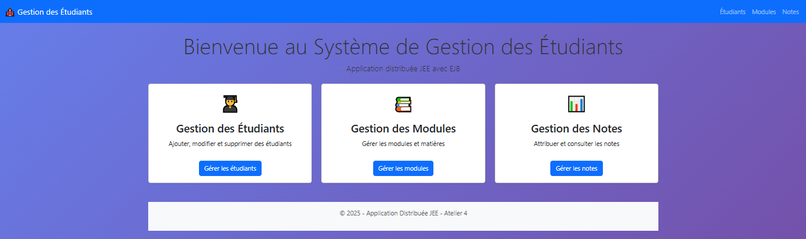
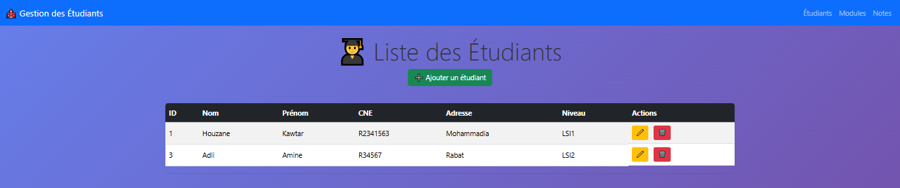
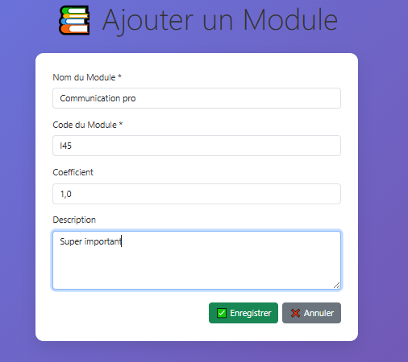
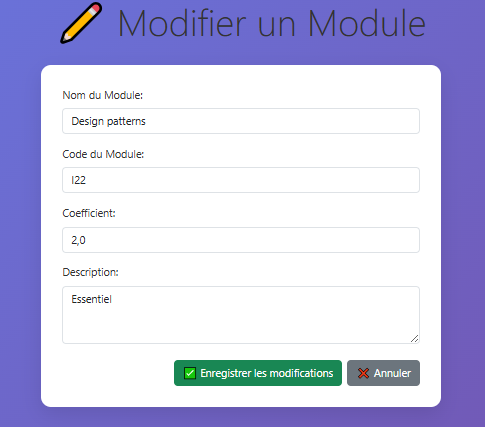

# Atelier 4 : Mise en place d’une application distribuée JEE
## Introduction : 
L’objectif de cet atelier était de maîtriser les technologies JEE modernes à travers la conception d’une application distribuée complète utilisant :Jakarta EE 10, EJB 4.0 (Stateless Session Bean), JPA (Hibernate), Servlets 6.0 & JSP, WildFly 37.0.1.Final, MySQL, Maven & IntelliJ IDEA. 
Le projet implémente un système de gestion académique avec CRUD complet sur trois entités : Étudiants, Modules, Notes (Suivies).

## Technologies Clés

*   **Java:** Version 17+
*   **Jakarta EE:** Version 9.1+
*   **EJB (Enterprise JavaBeans):** Session Beans (Stateless) pour les services métier.
*   **JPA (Jakarta Persistence API) / Hibernate:** Pour la couche de persistance.
*   **Maven:** Pour la gestion de projet et la construction du module.
*   **Lombok:** Pour réduire le code boilerplate des entités.

## Configuration de la Base de Données
### Schéma de la Base de Données SQL
```sql
-- Création de la base de données
                        CREATE DATABASE IF NOT EXISTS getudiants 
                        CHARACTER SET utf8mb4 
                        COLLATE utf8mb4_unicode_ci;

-- Étudiants
CREATE TABLE etudiants (
                           id_etudiant BIGINT PRIMARY KEY AUTO_INCREMENT,
                           nom VARCHAR(50) NOT NULL,
                           prenom VARCHAR(50) NOT NULL,
                           cne VARCHAR(20) UNIQUE NOT NULL,
                           adresse TEXT,
                           niveau VARCHAR(20)
);

-- Modules
CREATE TABLE modules (
                         id_module BIGINT PRIMARY KEY AUTO_INCREMENT,
                         nom_module VARCHAR(100) NOT NULL,
                         code_module VARCHAR(20) UNIQUE NOT NULL,
                         coefficient DECIMAL(4,2) NOT NULL,
                         description TEXT
);

-- Notes (Suivies)
CREATE TABLE suivies (
                         id_suivie BIGINT PRIMARY KEY AUTO_INCREMENT,
                         note DECIMAL(4,2) NOT NULL,
                         date_examen DATE NOT NULL,
                         etudiant_id BIGINT NOT NULL,
                         module_id BIGINT NOT NULL,
                         FOREIGN KEY (etudiant_id) REFERENCES etudiants(id_etudiant),
                         FOREIGN KEY (module_id) REFERENCES modules(id_module)
);
```


## Fonctionnalités :
### 1. Gestion des Étudiants 
    ✅ Lister tous les étudiants avec pagination
    ✅ Ajouter un nouvel étudiant
    ✅ Modifier les informations d'un étudiant
    ✅ Supprimer un étudiant (avec confirmation)
### 2. Gestion des Modules
    ✅ Lister tous les modules disponibles
    ✅ Ajouter un nouveau module
    ✅ Modifier les informations d'un module
    ✅ Supprimer un module
### 2. Gestion des notes
    ✅ Lister toutes les notes avec détails
    ✅ Ajouter une nouvelle note pour un étudiant/module
    ✅ Modifier une note existante
    ✅ Supprimer une note


## Captures d'écran
### Page d'accueil

### Liste des étudiants

### Formulaire d'ajout

### Liste des modules

### Ajouter un module

### Modifier un module

### Gestion des notes

